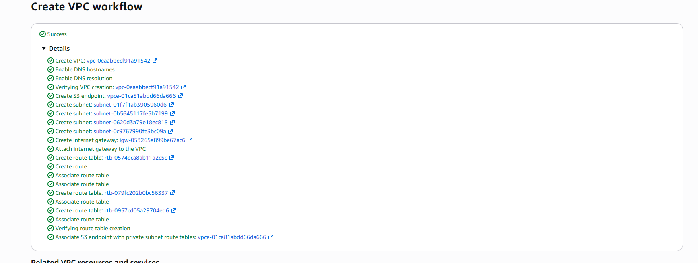
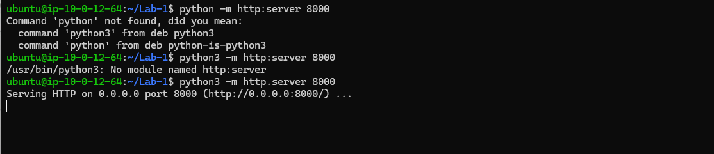
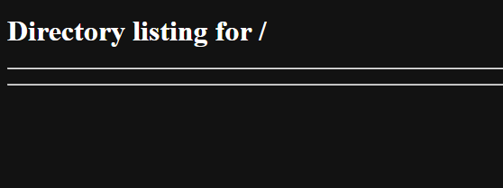
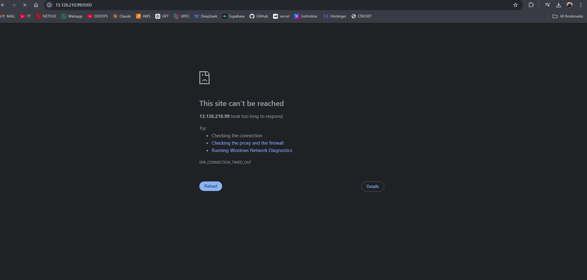
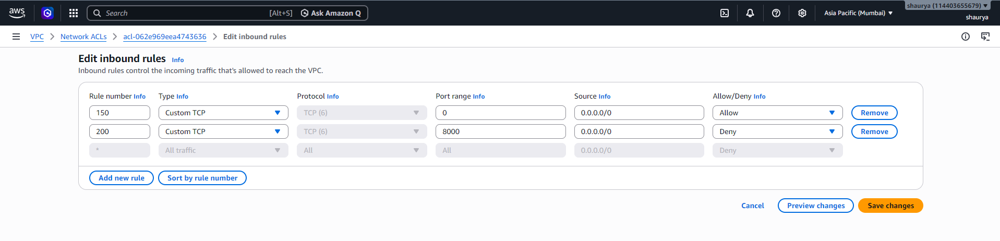

# ☁️ AWS Lab 01 - VPC, EC2 & Network ACL

> Hands-on AWS networking lab covering VPC creation, EC2 deployment, Security Groups, and Network ACL troubleshooting.

---

## 📋 Lab Workflow

```text
Create VPC
    ↓
Launch EC2
    ↓
Assign Public IP
    ↓
Run Python HTTP Server
    ↓
Troubleshoot Security Group
    ↓
Test Network ACL Rules
```

---

## 🏗️ Infrastructure

| Component  | Configuration      |
| ---------- | ------------------ |
| VPC        | `project-vpc`      |
| Subnet     | Public             |
| EC2        | Ubuntu             |
| Public IP  | Enabled            |
| Web Server | Python HTTP Server |
| Port       | 8000               |

---

## 🚀 Deployment

### Update System

```bash
sudo apt update
```

### Configure Git

```bash
git config --global user.name "Your Name"
git config --global user.email "your-email@example.com"
```

### Start Web Server

```bash
python3 -m http.server 8000
```

---

## 🔒 Security Group Troubleshooting

The Python server was running successfully but was not accessible from the browser.

**Cause:**

* Port 8000 was blocked by the default Security Group configuration.

**Solution:**

Added an inbound rule:

| Type       | Port | Source    |
| ---------- | ---- | --------- |
| Custom TCP | 8000 | 0.0.0.0/0 |

---

## 🔥 Network ACL Experiment

To understand subnet-level security, a deny rule for port **8000** was created.

### Rule Priority Test

| Rule Number | Action    | Result    |
| ----------- | --------- | --------- |
| 100         | Allow All | ✅ Allowed |
| 200         | Deny 8000 | Ignored   |

| Rule Number | Action    | Result    |
| ----------- | --------- | --------- |
| 100         | Deny 8000 | ❌ Blocked |
| 200         | Allow All | Ignored   |

**Observation:**

AWS Network ACLs process rules from the lowest rule number to the highest. The first matching rule is applied.

---

## 📸 Screenshots

## 📸 Screenshots

### VPC Creation



---

### EC2 Launch



---

### Python Server



---

### Website Access



---

### NACL Rules


---

## 📚 Key Learnings

* AWS VPC Fundamentals
* EC2 Networking
* Public Subnets
* Security Groups
* Network ACLs
* Python HTTP Server
* AWS Network Troubleshooting

---

## 🛠️ Tech Stack

* AWS VPC
* AWS EC2
* Ubuntu Linux
* Git
* Python
* Security Groups
* Network ACLs

---

## ✅ Conclusion

This lab provided hands-on experience with AWS networking and demonstrated how Security Groups and Network ACLs affect application accessibility in real-world DevOps environments.
