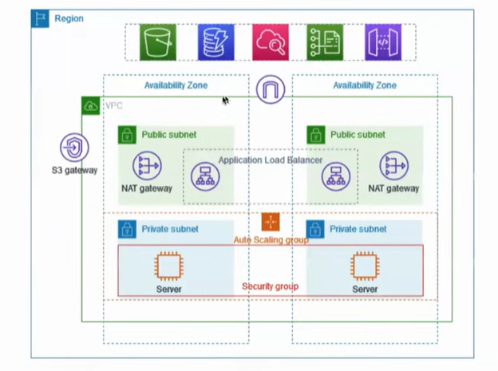
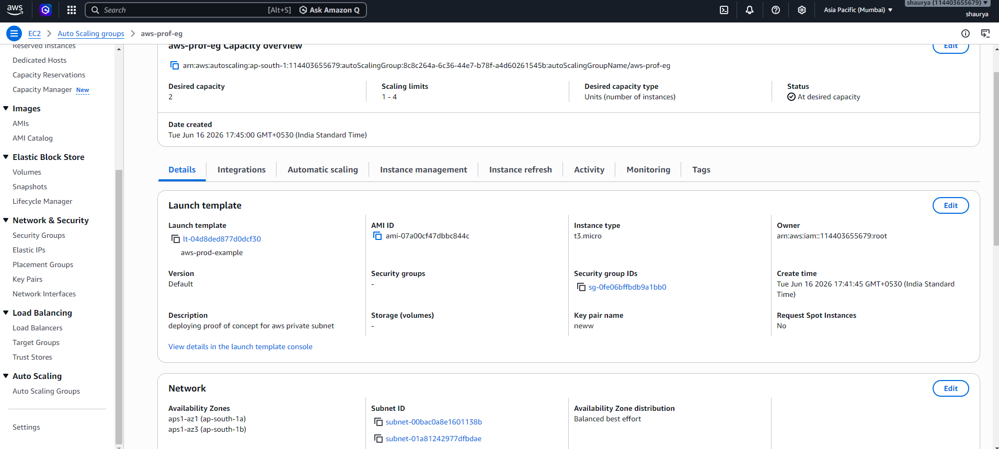
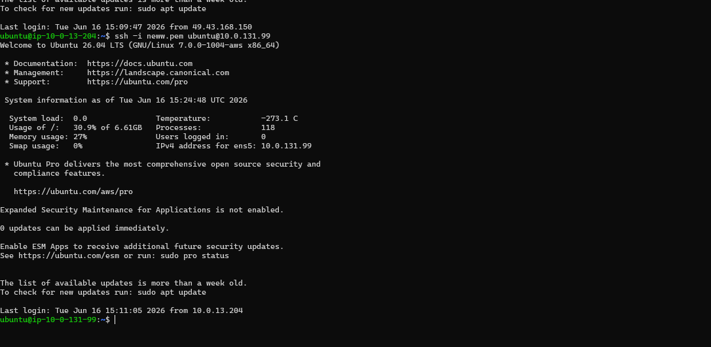
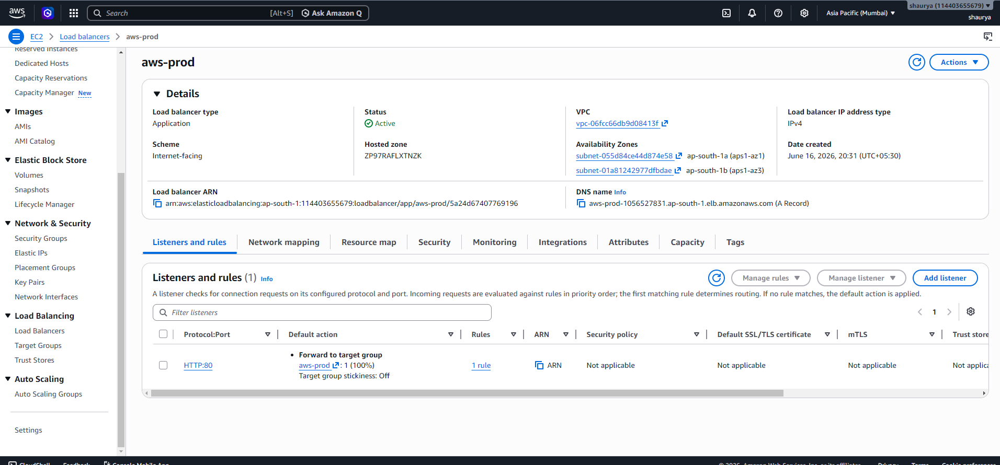
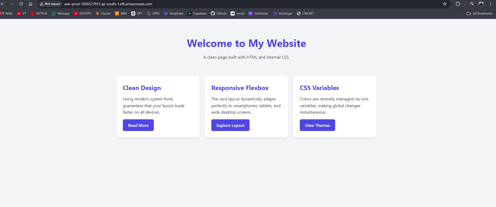

<div align="center">


# ☁️ Lab 02 — Production-Style Application Deployment on AWS

### Private subnets. NAT Gateway. Bastion Host. Auto Scaling. Load Balancer. The full production networking stack — built from scratch.

[← Lab 01: VPC & NACLs](../01-VPC-NACL/) | [Back to Lab Index](../README.md) | [Lab 03: IAM →](../03-IAM/)

</div>

---

## 🎯 Objective

Design and deploy a production-style AWS architecture where:

- Application servers **never touch the public internet** directly
- Traffic reaches them **only through an Application Load Balancer**
- Admin access is possible **only through a Bastion Host**
- The system **scales automatically** and survives instance failure

This isn't a hello-world deployment. This is the architecture pattern used in real production environments.

---

## 🏗️ Architecture

```
                        ┌─────────────────────────────────────────────────┐
                        │                  project-vpc                     │
                        │                                                  │
Internet ──────────► Internet Gateway                                      │
                        │                                                  │
                        │   ┌─────────────────────────────────────────┐   │
                        │   │             Public Subnets               │   │
                        │   │                                          │   │
                        │   │  ┌───────────────┐  ┌───────────────┐  │   │
         Users ──────────────► │      ALB       │  │  Bastion Host │  │   │
                        │   │  └───────┬───────┘  └───────┬───────┘  │   │
                        │   │          │                   │ SSH only  │   │
                        │   │  ┌───────▼───────┐          │           │   │
                        │   │  │  NAT Gateway  │          │           │   │
                        │   └──┴───────┬───────┴──────────┼───────────┘   │
                        │             │                   │               │
                        │   ┌─────────▼───────────────────▼───────────┐   │
                        │   │             Private Subnets              │   │
                        │   │                                          │   │
                        │   │  ┌────────────┐    ┌────────────┐       │   │
                        │   │  │  EC2 (AZ1) │    │  EC2 (AZ2) │       │   │
                        │   │  │  Port 8000 │    │  Port 8000 │       │   │
                        │   │  └────────────┘    └────────────┘       │   │
                        │   │         Auto Scaling Group (2–4)        │   │
                        │   └─────────────────────────────────────────┘   │
                        └─────────────────────────────────────────────────┘
```



---

## ⚙️ Infrastructure Overview

| Component | Configuration | Purpose |
|-----------|-------------|---------|
| VPC | Custom `project-vpc` | Isolated network |
| Public Subnets | 2 AZs | ALB + Bastion Host |
| Private Subnets | 2 AZs | Application servers (no public IP) |
| Internet Gateway | Attached to VPC | Public subnet internet access |
| NAT Gateway | 1 per AZ | Private subnet outbound-only internet |
| EC2 Instances | Ubuntu, no public IP | App servers — private only |
| Bastion Host | Ubuntu, public subnet | Admin jump server |
| Launch Template | Ubuntu AMI + SG config | ASG instance blueprint |
| Auto Scaling Group | Min 2 / Desired 2 / Max 4 | High availability + auto scaling |
| Application Load Balancer | Public-facing | Traffic distribution |
| Target Group | Port 8000 | Routes ALB traffic to EC2s |

---

## 🚀 Implementation

### Step 1 — VPC & Subnet Setup

Created a custom VPC with both public and private subnets across two Availability Zones.

**Why two AZs?** If one AZ goes down (hardware failure, outage), the other keeps serving traffic. This is the minimum for production high availability.

- Public subnets: host the ALB and Bastion Host
- Private subnets: host the application EC2 instances
- Internet Gateway: attached and route table updated for public subnets
- NAT Gateway: deployed in each public AZ, route tables updated for private subnets

> **NAT Gateway explained:** Private EC2 instances have no public IP, so they can't reach the internet directly. The NAT Gateway lets them make *outbound* requests (e.g., `apt update`, pulling packages) without being reachable from the internet inbound. Outbound only.

---

### Step 2 — Launch Template

Created a Launch Template defining the blueprint for every EC2 instance the Auto Scaling Group spins up:

- Ubuntu AMI
- Instance type (t2.micro)
- Security Group (app server SG — port 8000 from ALB only)
- No public IP assignment

Using a Launch Template instead of manual EC2 creation means every instance is **identical and reproducible** — no configuration drift.

---

### Step 3 — Auto Scaling Group

| Setting | Value | Reasoning |
|---------|-------|-----------|
| Minimum | 2 | Always 2 instances — one per AZ minimum |
| Desired | 2 | Normal operating state |
| Maximum | 4 | Scale out under high load |

The ASG uses the Launch Template to spin up instances automatically. If an instance fails its health check, ASG terminates and replaces it without manual intervention.



---

### Step 4 — Bastion Host

Private EC2 instances have no public IP — they can't be SSH'd into directly. The Bastion Host solves this.

**Flow:** Your laptop → SSH → Bastion Host (public) → SSH → Private EC2

**Step 4a — Copy the key to the Bastion Host**

```bash
# From your local machine — copy the PEM key to the bastion
scp -i "C:\Users\shaur\Downloads\neww.pem" "C:\Users\shaur\Downloads\neww.pem" ubuntu@<BASTION_PUBLIC_IP>:/home/ubuntu/
```

**Step 4b — SSH into Bastion**

```bash
ssh -i "neww.pem" ubuntu@<BASTION_PUBLIC_IP>
```

**Step 4c — From Bastion, SSH into private instance**

```bash
chmod 400 neww.pem
ssh -i neww.pem ubuntu@<PRIVATE_INSTANCE_IP>
```

> **Security note:** In production, use SSH Agent Forwarding (`ssh -A`) instead of copying the private key to the bastion. Storing private keys on any server is a security risk. This lab copies the key for simplicity.



---

### Step 5 — Deploy Application

Once inside each private EC2 instance, deployed the sample app:

```bash
python3 -m http.server 8000
```

Running this on all instances managed by the ASG. The ALB will distribute requests across them.

---

### Step 6 — Application Load Balancer

Created an ALB in the public subnets with a Target Group pointing to port 8000 on the private instances.

**Health checks enabled** — ALB continuously pings each instance. If a response isn't received, that instance is removed from rotation until it recovers.



---

## 🔒 Security Group Design

This is the most important part of the lab. The SG chain ensures **zero direct public access to app servers**.

```
Internet
   │
   ▼
[ALB Security Group] ── allows: HTTP port 80 from 0.0.0.0/0
   │
   ▼
[App Server Security Group] ── allows: TCP port 8000 from ALB-SG only
                              ── blocks: everything else, including direct internet
```

### ALB Security Group

| Type | Protocol | Port | Source | Why |
|------|----------|------|--------|-----|
| HTTP | TCP | 80 | `0.0.0.0/0` | Public users reach the ALB |

### App Server Security Group

| Type | Protocol | Port | Source | Why |
|------|----------|------|--------|-----|
| Custom TCP | TCP | 8000 | `ALB Security Group ID` | Only ALB can talk to the app servers |

> **Key pattern:** Source is the ALB's **Security Group ID**, not a CIDR block. This means only traffic that passed through the ALB is allowed — even if someone knew a private IP, they couldn't reach the instance directly.

---

## ✅ Result

Application accessible via ALB DNS — traffic distributed across private EC2 instances:

```
http://aws-prod-1056527831.ap-south-1.elb.amazonaws.com/
```



---

## 📚 Key Learnings

**Architecture decisions that matter:**

- **Private subnets for app servers** — removes them from the internet attack surface entirely. The ALB is the only entry point.
- **NAT Gateway per AZ** — if one AZ's NAT fails, the other AZ's private instances still have outbound access. One NAT for both AZs is a single point of failure.
- **SG-to-SG referencing** — using the ALB's SG as the source (not a CIDR) is more secure and doesn't break when IPs change.
- **Launch Templates over Launch Configurations** — Templates support versioning; Configurations are legacy. Always use Templates.

**Operational patterns:**
- Auto Scaling self-heals — failed instances are replaced automatically
- ALB health checks are the signal ASG uses to determine instance health
- Bastion Hosts are a controlled chokepoint for admin access — all SSH goes through one auditable path

**Common mistakes this lab surfaced:**
- Forgetting outbound rules on NACLs (stateless, unlike SGs)
- Registering instances to the Target Group manually before realizing ASG does it automatically
- NAT Gateway requires an Elastic IP — easy to miss in setup

---

## ✅ Lab Completion Checklist

| Objective | Status |
|-----------|--------|
| Custom VPC with public + private subnets across 2 AZs | ✅ |
| Internet Gateway + NAT Gateway configured | ✅ |
| Launch Template created | ✅ |
| Auto Scaling Group deployed (min 2, max 4) | ✅ |
| EC2 instances running in private subnets (no public IP) | ✅ |
| Bastion Host deployed and private instance accessed via SSH | ✅ |
| Application running on port 8000 on private instances | ✅ |
| ALB created with Target Group and health checks | ✅ |
| SG chain configured — ALB → App Server only | ✅ |
| Application accessible via ALB DNS endpoint | ✅ |

---

<div align="center">

[← Lab 01: VPC & NACLs](../01-VPC-NACL/) | [Back to Lab Index](../README.md) | [Lab 03: IAM →](../03-IAM/)

*Private by default. Public by design. Scalable by architecture.*

</div>
